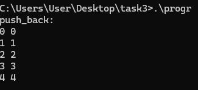
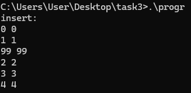
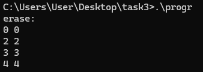
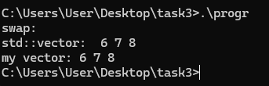
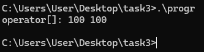

# v3.0

## 5 Funkcijų pavyzdžiai

* Sukurti std::vector ir Vector konteineriai v1 ir v2 atitinkamai

##### 1. push_back
* Abu konteineriai buvo užpildyti reikšmėmis 0-4

##### 2. insert
* Į 2 indeksą įterpta reikšmė 99

##### 3. erase
* Pašalintas elementas iš 1 indekso

##### 4. swap
* Abu konteineriai sukeisti (swap) su naujais konteineriais, kurie buvo užpildyti reikšmėmis 6-8

##### 5. operator[]
* Naudojant operator[], 1 indekso elementas pakeistas į 100

