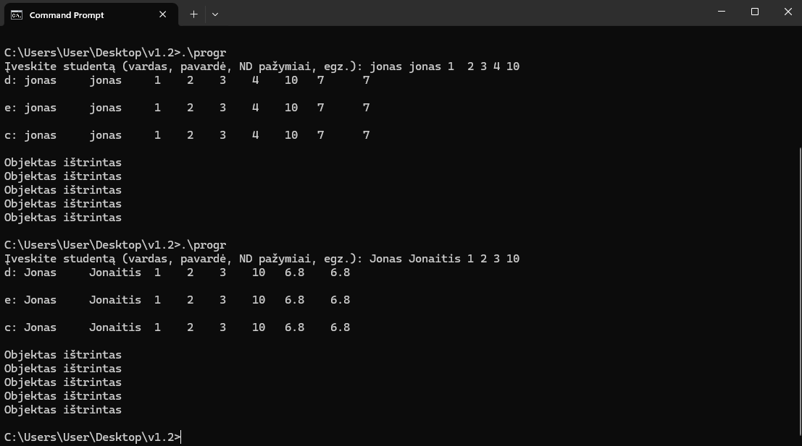
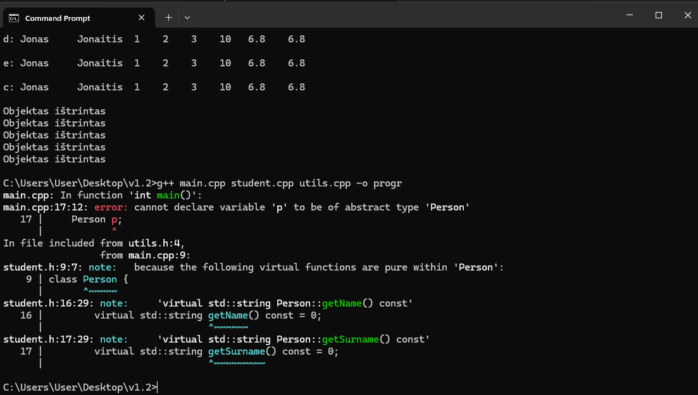

# v1.5

## Realizuota:

* Abstrakti klasė Person ir jos derived klasė Student
* Derived klasė palaiko Rule of Five bei įvesties/išvesties metodus

## Testavimas

* Programa veikia su v1.2 testavimo logika (pirmoji nuotrauka: rankinė įvestis, išvestis į ekraną)
* Person klasės objektų kūrimas pademonstruotas (antroji nuotrauka: kūrimas neveikia)

